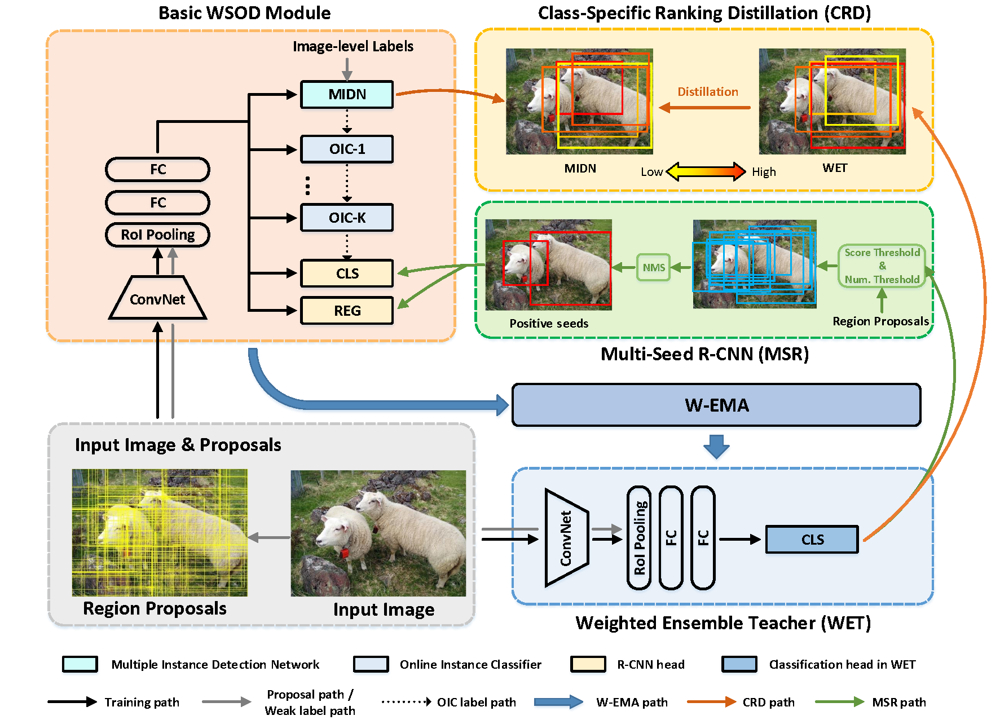

# Cyclic-Bootstrap Labeling for Weakly Supervised Object Detection

This is the official PyTorch implementation of CBL (ICCV 2023). [[**PDF**]](https://openaccess.thecvf.com/content/ICCV2023/papers/Yin_Cyclic-Bootstrap_Labeling_for_Weakly_Supervised_Object_Detection_ICCV_2023_paper.pdf) 

This implementation can achieve the performance of **57.4% mAP** and  **71.8% CorLoc** on VOC2007 dataset.


> **Cyclic-Bootstrap Labeling for Weakly Supervised Object Detection  (ICCV 2023)** \
> Yufei Yin, Jiajun Deng, Wengang Zhou, Li Li, and Houqiang Li.





# Installation
Check [INSTALL.md](https://github.com/Yinyf0804/CBL-WSOD/blob/main/INSTALL.md) for installation instructions.

# Datasets
Check [DATASETS.md](https://github.com/Yinyf0804/CBL-WSOD/blob/main/DATASETS.md) for dataset preparation.

# Model Zoo
Check [MODEL_ZOO.md](https://github.com/Yinyf0804/CBL-WSOD/blob/main/MODEL_ZOO.md) for pretrained models.
Pretrained model needs to be downloaded.

The final structure of data/ are as follows:
  ```bash
  data/
  data/pretrained_model/
  data/selective_search_data/
  data/VOC2007/
  ```


# Training

**Train** a CBL network on VOC2007 (Only support single-gpu training). 

  ```bash
  CUDA_VISIBLE_DEVICES=0 python tools/train_net_step.py --dataset voc2007 \
    --cfg configs/vgg16_voc2007_oicr_cbl.yaml --bs 1 --nw 4 --iter_size 4
  ```

# Inference
 **Test** a CBL network on VOC2007 (Only support single-gpu testing). 
 
    
 ### Test on test split with mAP:
 ```bash
  python tools/test_net.py --cfg configs/vgg16_voc2007_oicr_cbl.yaml \
    --load_ckpt $MODEL_PATH \
    --dataset voc2007test
    
  # (Optional)
  python tools/reeval.py $TEST_DIR/detections.pkl \
    --dataset voc2007test --cfg configs/vgg16_voc2007_oicr_cbl.yaml
  ```
    
 ### Test on trainval split with CorLoc:
 ```bash
  python tools/test_net.py --cfg configs/vgg16_voc2007_oicr_cbl.yaml \
    --load_ckpt $MODEL_PATH \
    --dataset voc2007trainval

  python tools/reeval.py $TEST_DIR/discovery.pkl \
    --dataset voc2007trainval --cfg configs/vgg16_voc2007_oicr_cbl.yaml \
    --style corloc
  ```
  
  ### Default directory (models & test results):
  ```bash
  $OUTPUT_DIR = output/oicr_cbl/
  $CONFIG_NAME = vgg16_voc2007_oicr_cbl
  $MODEL_NAME = model_step34999.pth
  $STEP = model_step34999
  $MODEL_PATH = $OUTPUT_DIR/$CONFIG_NAME/ckpt/$MODEL_NAME
  $TEST_DIR = $OUTPUT_DIR/$CONFIG_NAME/test/$STEP
  ```
  You can change them in [configs/vgg16_voc2007_oicr_cbl.yaml](https://github.com/Yinyf0804/CBL-WSOD/blob/main/configs/vgg16_voc2007_oicr_cbl.yaml)
  
# Citation

If you find this code useful for your research, please use the following BibTeX entry.

```
@inproceedings{yin2023cyclic,
  title={Cyclic-Bootstrap Labeling for Weakly Supervised Object Detection},
  author={Yin, Yufei and Deng, Jiajun and Zhou, Wengang and Li, Li and Li, Houqiang},
  booktitle={Proceedings of the IEEE/CVF International Conference on Computer Vision},
  pages={7008--7018},
  year={2023}
}
```

# Acknowledgement
The codes are based on [PCL](https://github.com/ppengtang/pcl.pytorch/tree/0.4.0). Thanks for the wonderful work!